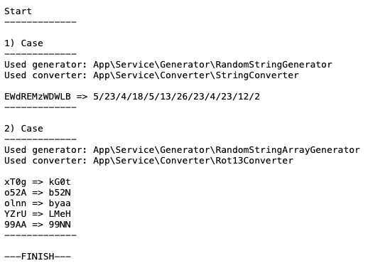
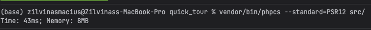
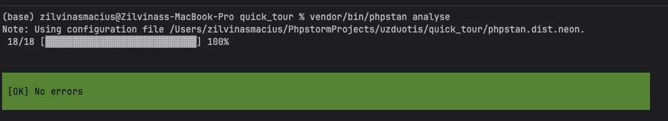
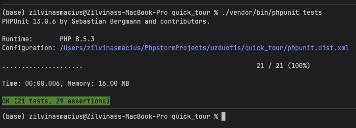

# Task

## Instruction to run project
- Install composer
- Run composer install
- Run php server


## To start server
```bash
symfony server:start
```


## To run phpcs
```bash
vendor/bin/phpcs --standard=PSR12 src/
```


## To run phpstan
```bash
vendor/bin/phpstan analyse
```


## To run phpunit
```bash
./vendor/bin/phpunit tests
```

